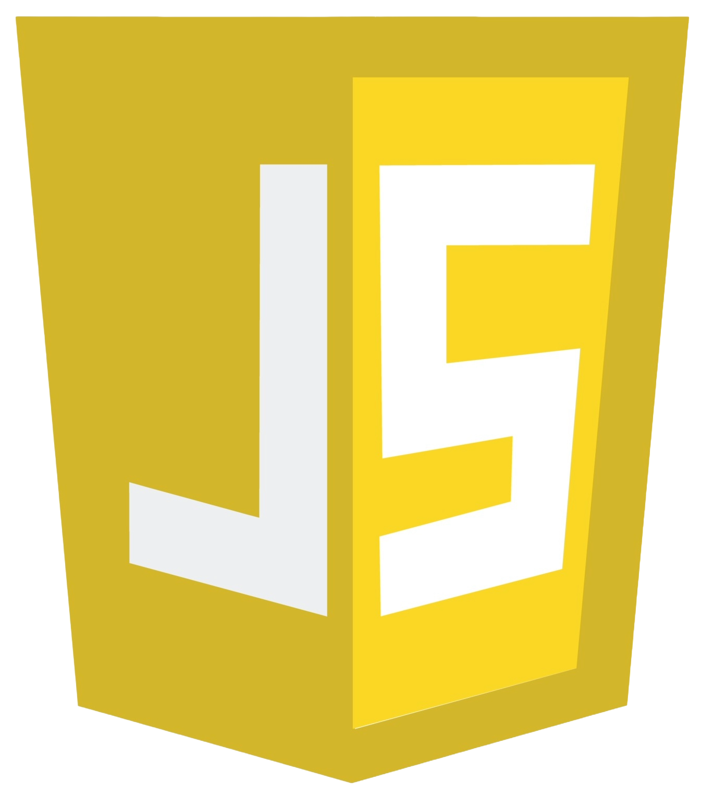

<!-- Header Section -->
<h1 align="center">Hi👋, I'm Srushti Chaudhari </h1>
<h3 align="center"><a href="https://www.linkedin.com/in/srushti-chaudhari-ai30/" target="_blank" rel="noreferrer">Srushti</a> is a passionate AI Engineer, Learning and working on AI/ML Projects.</h3>
 

<!-- GIF -->

<!-- Languages and Tools Section -->
<!-- <h3 align="left">Languages and Tools:</h3>

-  -->

#### Programming Language Stack

    

#### FrontEnd Stack

      

<!-- #### BackEnd Stack

 -->

#### Database Stack

 

#### Project Management Stack

   

#### Editor / IDE I ♥

 

<!-- Contact Section -->
<h3 align="left">Connect with me:</h3>

<!-- - 💬 Ask me about **Development** -->
- 📫 How to reach me **[chaudharisrushti530@gmail.com](mailto:chaudharisrushti530@gmail.com)**
<!-- - ⚡ Fun fact **I've hit coding milestones and bullseyes, earning the title of a shooting champion while mastering code.** -->
